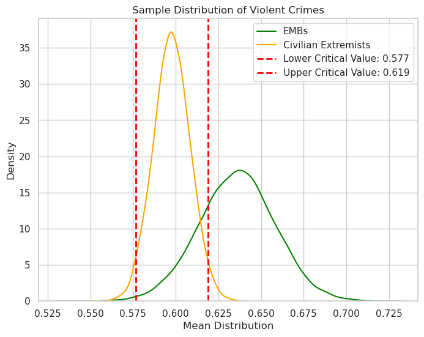

# US Military Extremist Profile Data Analysis  
  

# Overview
The Oxford Advanced American Dictionary defines the word [extremist](https://www.oxfordlearnersdictionaries.com/us/definition/american_english/extremist) as 'a person whose opinions, especially about religion or politics, are extreme, and who may do things that are violent, illegal, etc. for what they believe'.  

 As our country becomes more divided, it is important that the military as an institution remains apolitical so that the public may continue to leave their trust and confidence in the men and women dedicated to serving in their nation's interests. All service members are discplined to incorporate this standard into their very being; however, there are still few who are susceptible to stray from the norm, and of that group there are a minority that have turned to extremism.

 The following analysis undertakes the challenge of identifying whether or not extremists with a military background, or EMB's, have a different likelihood than civillian extremsist, or CEs, of commiting a violent crime.
 
 Beyond that, we oberserve how well a logistic regression can predict if an extremist will commit a violent crime.

 ## Purpose   
 The purpose of this analysis is to identify if EMBs have a different likelihood than CEs to commit a violent crime and to predict if an extremist will commit one. This information would serve well to provide DoD decision makers with which factors are most likely to indicate whether an already identified radicalized troop will commit a violent crime so that they may establish appropriate and safe countermeasures.

# MVP
The Minimum Viable Product of this project is to produce results from a hypothesis test, and to create two Logisitic Regression Models, one for civilian extremists and the other for extremists with a military background. Both must be capable of predicting whether someone will commit a violent crime with a precision score over 55%.

# Data
The data that the following information is based off of comes from the ["Profiles of Individual Radicalization in the United States" (PIRUS) Dataset](https://www.start.umd.edu/data-tools/profiles-individual-radicalization-united-states-pirus). This data was collected and categorized by members of the National Consortium for the Study of Terrorism and Response to Terrorism, also known as START. It is an institution of researchers dedicated to improving the understanding of the human causes and consequences of terrorism. The PIRUS dataset contains deidentified individual-level information on the backgrounds, attributes, and radicalization processes of over 3,200 violent and non-violent extremists who adhere to far-right, far-left, Islamist, or single-issue ideologies in the United States from 1948 to 2021. This data was constructed using entirely public sources of information.

### Inclusion Criteria

In order to be eligible for inclusion into this data set, each individual must meet one of the following five criteria:  
    1. the individual was arrested;  
    2. the individual was indicted of a crime;  
    3. the individual was killed as a result of his or her ideological activities;  
    4. the individual is/was a member of a designated terrorist organization; or  
    5. the individual was associated with an extremist organization whose leader(s) or founder(s) has/have been indicted of an ideologically motivated violent offense.

In addition, each individual MUST:   
    1. have been radicalized in the United States,  
    2. have espoused or currently espouse ideological motives, and  
    3. show evidence that his or her behaviors are/were linked to the ideological motives he or she espoused/espouses.  

## Cleaning 
The original shape of the dataset has 3202 rows and 130 columns. After filtering for the most relevant columns and deleting rows with unhelpful data (such as NaN and null values), the final shape was 3106 rows and 15 columns.  

The columns found to be most valuable were: Violent, Age, Children, Military, Alcohol_Drug, Group Membership, Internet Radicalization, Marital Status, Sex, Religious Background, Education Level, Mental Illness, Criminal History, Angry US, and Group Grievance.

# Exploratory Data Analysis  
## Questions and Hypothesis
Before I even began working with the data I had to ask myself what do I even want know here? In order to ask a good question, I had to get a better idea of the data before by diving straight in.  

This data set possesses an impressive amount of in-depth information such as family background, trauma exprienced, psychological history, and even which websites radicalized the individual! Suprisingly, most of the columns were categorical but consisted of numbered values that represented the categories. I had to research the [PIRUS V4 Codebook](https://www.start.umd.edu/sites/default/files/files/research/PIRUSCodebook.pdf) (also can be found in data/PIRUS_March2023/PIRUS V4 Codebook.pdf of this repository) to decipher the number codes and convert them to human readable values.  
  
## Example: 

# Hypothesis Testing  

## Scientific Question  
- Do EMBs have a different likelihood of committing a violent crime than CEs?

## Hypotheses
- Null
  - Extremists with a military background have the <u>same</u> likelihood of committing a violent crime as civilian extremists.
- Alternative
  - Extremists with a military background have a  <u>different</u> likelihood of committing a violent crime than civilian extremists.

### Process  
Because I was trying to find a difference between the means of two samples, I conducted a two-tailed Independent Two-Sample T-Test. However, the sample size of EMBs was significantly smaller than CEs so I had to bootstrap both samples in order to get more accurate results. I got the means of 10,000 sub-samples for both military and civillian super-samples in order to get an acceptable normal distribution. I then conducted my independent test with an alpha of 5%.

### Results
My test resulted in a test statistic of 154.587 standard deviations and a p value so small that python redered it as 0.0.  
 This concludes that the odds of EMBs having the same likelihood of commiting a violent crime as CEs is so incredibly minuscule, that the Null Hypothesis must be rejected in favor of the Alternative.  

Below is a graph that illustrates my findings:  

  

Note that there are two red dashed lines illustrating my critical values. This is because I conducted a two-tailed test. Therefore my alpha of 5% had to be split to mark the thresholds of the upper and lower most 2.5% marks of the Civlian Extremist distribution so that we may indentify if the mean of the EMB distribution fell outside of their range. As you can see, it did.  

Mean of EMB = 0.6359  
STD of EMB = 0.02226  
Mean of Civilian Extremists = 0.59767  
STD of Civilian Extremists = 0.01077  

# Making Predictions with Logistic Regression
After testing my hypothesis, I sought out the ability to predict whether or not an extremist will commit a violent crime. A conventional way to achieve this would be to create a logistic regression, as I am only trying to come to a binary conclusion: yes or no.  

In order to produce viable results from the logistic regression model, I had to change my data a bit.

## Converting Values
As mentioned previously, a majority of the data was categorical, but represented by numbers. Fixing this required me to convert that data into their actual meaning via my very own "value_change()" function which utilizes the python map method. 

From there I had to create dummy variables from the columns with categorical data using the "pd.get_dummies()" function in order to feed the logistic regression model with binary values. This is done so that the model has a "yes/no" association with the training data which allows for a clearer understanding of the relationships between the independent variables and the given targets.

## Training the model
I wanted to train the model to predict whether or not someone will commit a violent crime, so I used the values under the "Violent" column as my target value, and everything else as my features.  

The other columns were dummy variables based off of the following:  
 Age, Children, Military, Alcohol_Drug, Group Membership, Internet Radicalization, Marital Status, Sex, Religious Background, Education Level, Mental Illness, Criminal History, Angry US, and Group Grievance.

In the end, I decided to create two models. One fitted for extremists with a military background, and the other for civilian extremists.  
  
The Military Model was capable of correctly identifying extremists commiting violent crimes with a 61% precision rate.  
The Civilian Model was capable of correctly identifying extremists commiting violent crimes with a 66% precision rate.

# Conclusion  

With the insights derived from this analysis, we can reasonably conclude that there is a high probability that extremists with a military background are more likely to commit violent crimes than civilian extremists, and that the breadth of information from this dataset is enough to predict violent extremism with an 60% precision rate at the very least.

# Future Goals
With more time I would liked to acquire more information on non-radical criminals with both military and non-military backgrounds so that I could design a model with a higher precision rate.

# Data Credits

- This data was collected from National Consortium for the Study of Terrorism and Response to Terrorism's [Profiles of Individual Radicalization in the United States (PIRUS) Dataset](https://www.start.umd.edu/data-tools/profiles-individual-radicalization-united-states-pirus) 
- I did not create nor do I own any data from the PIRUS Dataset
- In depth information about the dataset, certain terms, and criteria codes can be found [here](https://www.start.umd.edu/sites/default/files/files/research/PIRUSCodebook.pdf).

