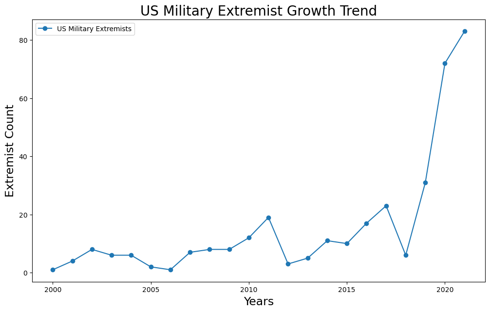
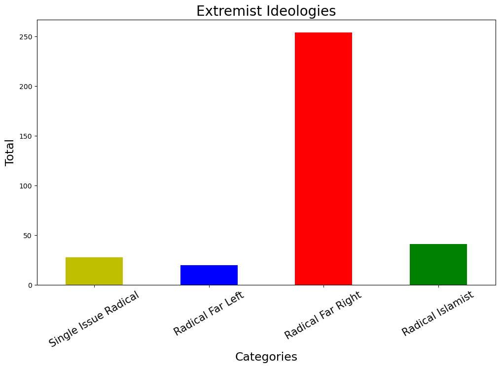
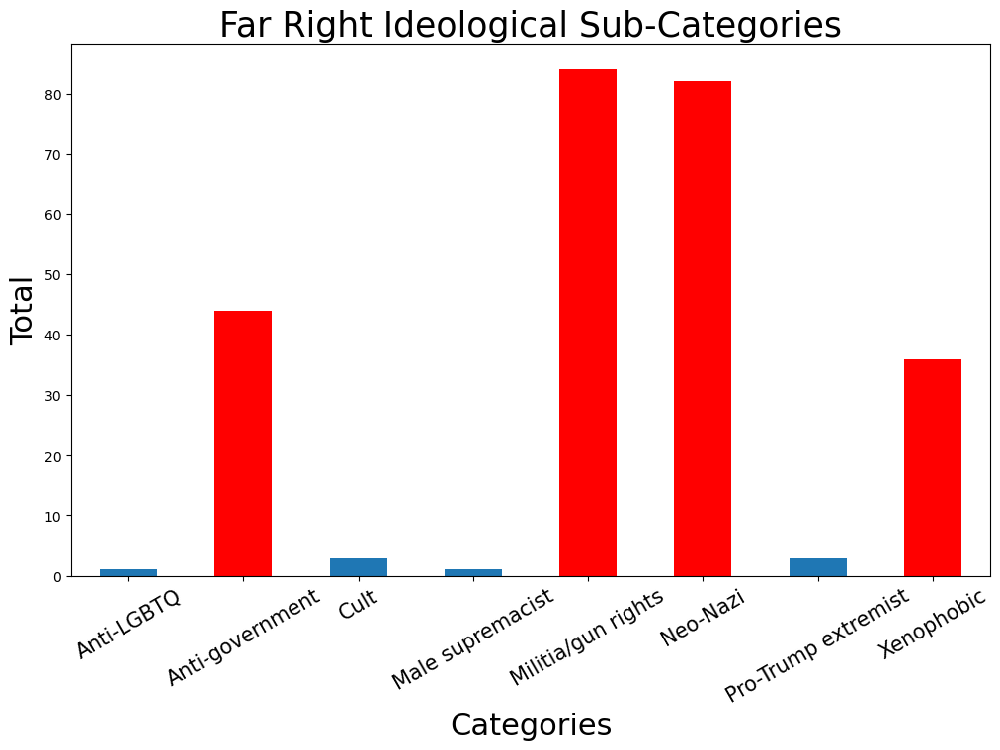
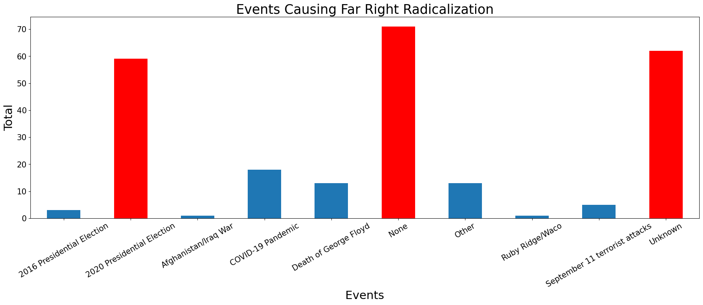

# US Military Extremist Profile Data Analysis  
  

# Overview
The Oxford Advanced American Dictionary defines the word [extremist](https://www.oxfordlearnersdictionaries.com/us/definition/american_english/extremist) as, 'a person whose opinions, especially about religion or politics, are extreme, and who may do things that are violent, illegal, etc. for what they believe'.  

 As our country becomes more divided, it is important that the military as an institution remains apolitical so that the public may continue to leave their trust and confidence in the men and women dedicated to serving in their nation's interests. All service members are discplined to incorporate this standard into their very being; however, there are still few who are susceptible to stray from the norm, and of that group there are a minority that have turned to extremism.

 The following analysis undertakes the challenge of identifying whether or not extremists with a military background have a different likelihood than civillian extremsist of commiting a violent crime. Beyond that, we

 ## Purpose
 
 The purpose of this analysis is to identify which ideology is most alluring to those US Military members that are prone to extremism and which events or factors would likely contribute to their radicalization. This information would serve well to provide DoD decision makers with which factors are most likely to radicalize their troops so that they may establish appropriate and safe countermeasures against radicalization.

# Data
The data that the following information is based off of comes from the ["Profiles of Individual Radicalization in the United States" (PIRUS) Dataset](https://www.start.umd.edu/data-tools/profiles-individual-radicalization-united-states-pirus). This data was collected and categorized by members of the National Consortium for the Study of Terrorism and Response to Terrorism, or START, which is an institution of researchers dedicated to improving the understanding of the human causes and consequences of terrorism. The PIRUS dataset contains deidentified individual-level information on the backgrounds, attributes, and radicalization processes of over 3,200 violent and non-violent extremists who adhere to far-right, far-left, Islamist, or single-issue ideologies in the United States from 1948 to 2021. This data was constructed using entirely public sources of information.

Given the purpose of this analysis, I will only be analyzing data related to individuals with a US military background between 2000-2021.

# Exploratory Data Analysis
## Questions and Hypothesis
Before I even began working with the data I had to ask myself what do I even want know here? In order to ask a good question, I had to get a better idea of the data before by diving straight in.  

This data set possesses impressively in-depth information such as family background, trauma exprienced, psychological history, and even which websites radicalized the individual! Suprisingly, most of the columns were categorical but consisted of numbered values that represented the categories. I had to research the [PIRUS V4 Codebook](https://www.start.umd.edu/sites/default/files/files/research/PIRUSCodebook.pdf) (also can be found in data/PIRUS_March2023/PIRUS V4 Codebook.pdf of this repository) to decipher the number codes and converted them to human readable values.

### Questions
I finally came up with five questions to work with:
1. What is the growth trend for extremists with a US military background since 2000?
2. What are the top ideologies for those extremist?
3. What are the top subcategories of that ideology?
4. Which events radicalized members of the categories if at all?
5. Through which means were they radicalized?  

### Hypothesis
Most of the extremists with a US Military background between 2000 and 2021 will likely be right-wing and will have been radicalized mostly through either media or social media with a visible significant spike in growth somewhere after 2016.

## 1. Extremist Growth Trend Since 2000
  
  
This connected scatter plot illustrates the growth trend of US Military Extremists between 2000-2021. There are a total of 343 extremists within this timeframe. Evidently there is a massive spike in growth starting at 2018. 

## 2. Extreme Ideologies Total
  
  
This bar graph indicates which Ideology is the most popular with these Extremists. It appears most of them grativate to the Radical Far-Right with a total of 254, or 74%.  

## 3. Top Right-Wing Sub-Categories
  
  
Within the Far-Right Ideology, there are four sub-categories that hold the majority of extremists: Anti-Government (44), Militia/Gun-Rights (84), Neo-Nazism (82), and Xenophobia (36).  

## 4. Radicalizing Events
  
  
This bar graph illustrates which events, if at all, contributed to radicalizing the most extremists from the top Far-Right Sub-Categories. The 2020 Election radicalized 59 people, or 24%, but the most interesting part is that most of the other extremists either had no radicalizing event, or their event is unknown, amassing 54% of the pool.

# Conclusion  

With the information derived from this analysis, we can reasonably conclude that most extremists with a US Military background fall within the Radical Far-Right Ideology, and that the events contributing to their radicalization are either unknown or none at all. One logical conclusion could be that most of these radicals already held their beliefs regardless of outside forces. However, because it is generally well known that most people who join the military tend to lean conservatively anyway, it makes sense that if there were going to be any extremists with a Military Background at all, they would most likely be Radically Right-Winged.

# Future Goals
With more time I would have liked to dive deeper into the personal traits of these individuals. The data I left out such as Socioeconomic status, Psychological History, Criminal History, Education, Marital status, childhood trauma, etc would have been interesting to work with as I could have potentially found a trend for people most prone to turning to extremism.

# Data Credits

- This data was collected from National Consortium for the Study of Terrorism and Response to Terrorism's [Profiles of Individual Radicalization in the United States (PIRUS) Dataset](https://www.start.umd.edu/data-tools/profiles-individual-radicalization-united-states-pirus) 
- I did not create nor do I own any data from the PIRUS Dataset
- In depth information about the dataset, certain terms, and criteria codes can be found [here](https://www.start.umd.edu/sites/default/files/files/research/PIRUSCodebook.pdf).

